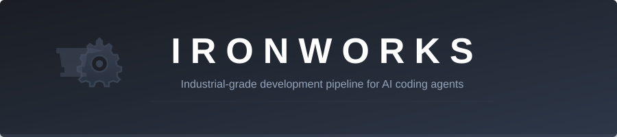
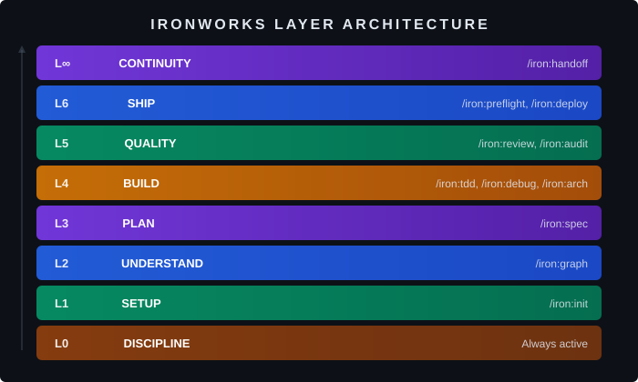

<!-- Ironworks: 12 production-grade skills for AI coding agents. Works with Claude Code, Cursor, GitHub Copilot, Windsurf, Cline, Gemini CLI, and 10+ more platforms. Open source MIT. -->

<p align="center">
  
</p>

<p align="center">
  <strong>AI coding agent skills for Claude Code, Cursor, GitHub Copilot, and your entire development pipeline.</strong><br>
  12 production-grade skills across 7 layers — from project bootstrap to deploy preflight.
</p>

<p align="center">
  <a href="LICENSE"></a>
  <a href="https://github.com/RahulHulsure/-Ironworks/stargazers"></a>
  <a href="https://github.com/RahulHulsure/-Ironworks/network/members"></a>
  <a href="https://github.com/RahulHulsure/-Ironworks/issues"></a>
  
  
  
</p>

<p align="center">
  <a href="#-quick-start">Quick Start</a> •
  <a href="#%EF%B8%8F-supported-platforms">Platforms</a> •
  <a href="#-all-12-skills">Skills</a> •
  <a href="#-workflows">Workflows</a> •
  <a href="#-origins">Origins</a> •
  <a href="#-roadmap">Roadmap</a>
</p>

---

## 🚀 Quick Start

Install for your AI coding tool:

```bash
# Claude Code (plugin install)
claude plugin install ironworks

# Cursor
cp -r platforms/cursor/rules/ .cursor/rules/

# GitHub Copilot
cp platforms/copilot/copilot-instructions.md .github/copilot-instructions.md

# Windsurf / Devin Desktop
cp -r platforms/windsurf/rules/ .windsurf/rules/

# OpenAI Codex
cp AGENTS.md .   # Already works — Codex reads AGENTS.md natively

# Gemini CLI
cp platforms/gemini/GEMINI.md .

# Or use the universal installer (auto-detects your tools)
git clone https://github.com/RahulHulsure/-Ironworks.git
cd ironworks-skills
./install.sh                  # macOS/Linux
.\install.ps1                 # Windows
```

After installing, **Layer 0 is automatically active** — the discipline ladder, output priority, and security rules run every response. No command needed.

```bash
# Your first commands
/iron:help                    # See all commands
/iron:init                    # Scaffold a new project
/iron:graph                   # Map an existing codebase
/iron:spec propose <feature>  # Plan a feature before building
```

> **16+ platforms supported** — see the [full platform list](#-supported-platforms) for Cline, Aider, Amazon Q, Kiro, Roo Code, Continue.dev, JetBrains Junie, Trae, Augment, Kilo Code, and Google Antigravity.

---

## ⚙️ The Layer Architecture

Ironworks organizes skills into layers that compose naturally across the development lifecycle. Each layer builds on the ones below. You don't need every layer for every task — use what fits.

<p align="center">
  
</p>

```
Layer 0  DISCIPLINE   Always active — priority stack, discipline ladder, security rules
Layer 1  SETUP        /iron:init — project bootstrap
Layer 2  UNDERSTAND   /iron:graph — dependency map and codebase queries
Layer 3  PLAN         /iron:spec — spec-driven feature proposals
Layer 4  BUILD        /iron:tdd, /iron:debug, /iron:arch — construction and quality
Layer 5  QUALITY      /iron:review, /iron:audit — review and simplification
Layer 6  SHIP         /iron:preflight, /iron:deploy — deployment validation
Layer ∞  CONTINUITY   /iron:handoff — session and team handoffs
```

---

## 📦 All 12 Skills

### Layer 0: Discipline — Always Active

No command needed. These rules enforce themselves every response via [`AGENTS.md`](AGENTS.md):

| Concept | What it does |
|---------|-------------|
| **Priority Stack** | correct → clear → performant → brief |
| **Output Priority** | Code first, explanation second. 3 lines max. |
| **Discipline Ladder** | YAGNI → reuse → stdlib → platform → installed dep → one line → minimum code |
| **Ironworks Marks** | `# ironworks:` comments on deliberate simplifications — name the ceiling and upgrade path |
| **Bug Fix Rules** | Target root cause, grep all callers, fix the shared function once |
| **Domain Language** | `CONTEXT.md` as shared glossary — challenge fuzzy terms |
| **Never Compromise** | Input validation, error handling, parameterized queries, auth, accessibility, minimal tests |

---

### Layer 1: `/iron:init` — Project Bootstrap

One command to scaffold a production-ready project.

```bash
/iron:init                           # Interactive — detects your stack
/iron:init --stack nextjs-fastapi    # Skip detection
/iron:init --minimal                 # Just git + CLAUDE.md + CONTEXT.md + .gitignore
```

**Detects 16+ stacks:** Next.js · React · FastAPI · Django · Go · Rust · Java · Elixir · Angular · Vue.js · SvelteKit · Express.js · Laravel · .NET/C# · Flutter/Dart · Scala

**Generates:**
- `CLAUDE.md` — project-specific agent instructions
- `CONTEXT.md` — domain glossary with canonical terms
- `docs/adr/0001-initial-stack-choice.md` — first Architecture Decision Record
- `ironworks/` — specs and changes directory
- `.env.example` · CI config · `.gitignore`

---

### Layer 2: `/iron:graph` — Codebase Dependency Map

Map the codebase before making changes. Every connection is confidence-scored.

```bash
/iron:graph                          # Full map with community detection
/iron:graph query "auth to payments?"  # BFS query (depth 3)
/iron:graph query "..." --dfs        # DFS query (depth 6, follows paths deeply)
/iron:graph query "..." --budget 1500  # Cap response at N tokens
/iron:graph deps backend/auth.py     # What depends on this file
/iron:graph hotspots                 # God nodes with community bridges
/iron:graph orphans                  # Dead code candidates
/iron:graph path "auth" "payments"   # Shortest path between concepts
/iron:graph --deep                   # Aggressive inference mode
/iron:graph --watch                  # Auto-rebuild on file changes
/iron:graph --update                 # Incremental rebuild (changed files only)
```

**Key features:**
- 🔗 **Confidence scoring** — every edge tagged `EXTRACTED` (1.0), `INFERRED` (0.4–0.9), or `AMBIGUOUS` (0.1–0.3)
- 🏘️ **Community detection** — files clustered into labeled subsystems with cohesion scores
- ⚡ **God node flagging** — files with 10+ incoming connections bridging multiple communities
- 🔍 **Surprise connections** — cross-community edges flagged for review

---

### Layer 3: `/iron:spec` — Spec-Driven Development

Every feature starts as a spec before it becomes code.

```
Explore → Propose → Apply → Verify → Archive
```

```bash
/iron:spec explore <topic>           # Research before committing (non-committal)
/iron:spec propose <name>            # Create proposal + requirements + design + tasks
/iron:spec apply                     # Implement tasks one by one
/iron:spec verify <name>             # Validate implementation matches spec
/iron:spec update <name>             # Revise planning docs (not code)
/iron:spec archive                   # Seal it, update living specs
/iron:spec show                      # View current state
```

**Key features:**
- 📋 **RFC 2119 keywords** — requirements use `SHALL`/`SHOULD`/`MAY`
- 🧪 **GIVEN/WHEN/THEN scenarios** — explicit testable scenarios
- 📝 **Delta spec markers** — `ADDED`/`MODIFIED`/`REMOVED` on archive
- 📖 **CONTEXT.md integration** — domain terms captured during explore and propose
- 📂 **Domain-based organization** — `ironworks/specs/auth/`, `ironworks/specs/payments/`

---

### Layer 4: `/iron:tdd` — Test-Driven Development

Red → Green → Refactor. Tests live at seams, never against internals.

```bash
/iron:tdd <feature>                  # Start a TDD cycle
/iron:tdd fix <bug>                  # Bug fix: regression test first
/iron:tdd continue                   # Resume last cycle
```

**Key features:**
- 🔗 **Seam-based testing** — from Michael Feathers' *Working Effectively with Legacy Code*
- ⚠️ **Anti-pattern detection** — implementation-coupled, tautological, horizontal slicing
- 🎯 **Mocking rules** — mock only at system boundaries (APIs, DBs, time/randomness)
- 📐 **Vertical slices** — one test → one implementation → repeat

---

### Layer 4: `/iron:debug` — Structured Debugging

Build a feedback loop first. No theorizing before you have a signal.

```bash
/iron:debug <problem description>    # Start structured debugging
/iron:debug narrow                   # Continue narrowing with new evidence
```

**10 feedback loop methods** (in priority order):
1. Failing test
2. Curl/HTTP script
3. CLI invocation with fixture
4. Headless browser script (Playwright/Puppeteer)
5. Replay a captured trace
6. Throwaway harness (minimal system subset)
7. Property/fuzz loop (1000 random inputs)
8. Bisection harness (`git bisect run`)
9. Differential loop (old vs new version)
10. HITL bash script (last resort)

**Also:** Tagged debug logs (`[DEBUG-xxxx]`) for guaranteed cleanup. Non-deterministic bug strategy (loop 100x, track failure rates).

---

### Layer 4: `/iron:arch` — Architecture Analysis

Deep module vocabulary from Ousterhout. Fowler smell baseline. Design-It-Twice for Critical issues.

```bash
/iron:arch                           # Full architecture scan
/iron:arch --focus <area>            # Scan a specific module
/iron:arch --quick                   # Top 5 issues only
/iron:arch --fix                     # Scan + Design-It-Twice proposals + ADRs
```

**Key features:**
- 📚 **Deep module vocabulary** — module, interface, depth, seam, adapter, leverage, locality (from *A Philosophy of Software Design*)
- 👃 **Fowler smell baseline** — 12 smells from *Refactoring* ch.3 as heuristic checks
- 🔀 **Design-It-Twice** — 2–3 radically different designs for Critical issues
- 📄 **ADR generation** — Architecture Decision Records in `docs/adr/`

---

### Layer 5: `/iron:review` — Smart Code Review

Two parallel axes that can't mask each other.

```bash
/iron:review                         # Review uncommitted changes
/iron:review --staged                # Staged changes only
/iron:review --fix                   # Review + auto-fix blockers
/iron:review --over-engineering      # Over-engineering scan only
```

| Axis | What it checks |
|------|---------------|
| **Standards** | Discipline ladder + 12 Fowler smells + security basics. Tags: `delete:` `stdlib:` `native:` `yagni:` `shrink:` |
| **Spec** | Requirements compliance + test coverage. Tests must test at seams, not internals. |

**Verdicts:** `SHIP IT ✓` · `FIX AND RESHIP` · `RETHINK`

---

### Layer 5: `/iron:audit` — Simplification Audit

Find unnecessary complexity. Track deliberate debt.

```bash
/iron:audit                          # Full audit with finding tags
/iron:audit --fix                    # Auto-simplify low-risk items
/iron:audit debt                     # Harvest ironworks: marks into a debt ledger
```

**Finding tags:** `delete:` (dead code) · `stdlib:` (hand-rolled stdlib) · `native:` (platform does it) · `yagni:` (speculative) · `shrink:` (same logic, fewer lines)

**Debt ledger** (`/iron:audit debt`): greps all `# ironworks:` comments, reports ceiling and upgrade path per marker, flags markers with no trigger.

---

### Layer 6: `/iron:preflight` — Deploy Preflight

Production readiness validation across 7 sections. Platform-specific checks for 6 platforms.

```bash
/iron:preflight                      # Full check
/iron:preflight --fix                # Auto-fix what's safe
/iron:preflight --platform docker    # Docker-specific checks
/iron:preflight --platform do        # DigitalOcean-specific checks
/iron:preflight --platform vercel    # Vercel (edge/serverless, function limits)
/iron:preflight --platform aws       # AWS (IAM, security groups, CloudWatch)
/iron:preflight --platform railway   # Railway (health, build, env)
/iron:preflight --platform fly       # Fly.io (auto-stop, volumes, secrets)
```

---

### Layer 6: `/iron:deploy` — Deployment Config

Generate production-ready configs. Migrate between platforms. Set up PR previews.

```bash
/iron:deploy docker                  # Dockerfile + docker-compose.yml
/iron:deploy do                      # DigitalOcean .do/app.yaml
/iron:deploy vercel                  # vercel.json
/iron:deploy railway                 # railway.toml
/iron:deploy aws                     # ECS task def + buildspec + appspec + IAM
/iron:deploy fly                     # fly.toml with health checks + auto-scaling
/iron:deploy migrate <source>        # Migrate FROM another platform
/iron:deploy preview                 # PR preview environment config
```

**Migration sources:** Heroku · Render · Railway · Fly.io · docker-compose · AWS ECS

**Environments:** `--env staging` (single instance, debug logging) vs `--env production` (multi-instance, approval gates, health checks required)

---

### Layer ∞: `/iron:handoff` — Session Handoff

Privacy-filtered session compression with cross-session continuity.

```bash
/iron:handoff                        # General handoff
/iron:handoff --for-agent            # Optimized for another Claude session
/iron:handoff --for-human            # Optimized for a team member
```

**Key features:**
- 🔄 **Session recall** — reads most recent handoff from `ironworks/handoffs/` at session start
- 🔒 **Privacy filtering** — redacts API keys (`sk-`, `AKIA`, `ghp_`, `xoxb-`), tokens, JWTs, passwords
- 📝 **Lessons learned** — captures what worked, what didn't, what was surprising
- 🧭 **Suggested next skills** — recommends `/iron:*` commands for the next session
- 🔀 **Phase boundary decisions** — Continue / Handoff / Subagent / Compact

---

## 🖥️ Supported Platforms

Ironworks works with **16+ AI coding tools**. The core skills are platform-agnostic — each platform gets adapter files in its native format.

| Platform | Type | Install |
|----------|------|---------|
| **Claude Code** | Plugin (full skills) | `claude plugin install ironworks` |
| **Cursor** | Rules (`.mdc`) | Copy `platforms/cursor/rules/` → `.cursor/rules/` |
| **GitHub Copilot** | Instructions | Copy `platforms/copilot/` → `.github/` |
| **Windsurf / Devin** | Rules | Copy `platforms/windsurf/rules/` → `.windsurf/rules/` |
| **OpenAI Codex** | AGENTS.md | Built-in — `AGENTS.md` in repo root |
| **Cline** | Rules | Copy `platforms/cline/` → `.clinerules/` |
| **Gemini CLI** | GEMINI.md | Copy `platforms/gemini/GEMINI.md` → project root |
| **Aider** | CONVENTIONS.md | Copy `platforms/aider/CONVENTIONS.md` → project root |
| **Amazon Q** | Rules | Copy `platforms/amazon-q/rules/` → `.amazonq/rules/` |
| **Kiro** | Steering | Copy `platforms/kiro/steering/` → `.kiro/steering/` |
| **Roo Code** | Rules | Copy `platforms/roo/rules/` → `.roo/rules/` |
| **Continue.dev** | Rules | Copy `platforms/continue/continuerules` → `.continuerules` |
| **JetBrains Junie** | Guidelines | Copy `platforms/junie/guidelines.md` → `.junie/guidelines.md` |
| **Trae** | Rules | Copy `platforms/trae/rules/` → `.trae/rules/` |
| **Augment Code** | Guidelines | Copy `platforms/augment/augment-guidelines` → `.augment-guidelines` |
| **Kilo Code** | Rules | Copy `platforms/kilo/rules/` → `.kilo/rules/` |
| **Google Antigravity** | Skills | Copy `platforms/antigravity/skills/` → `.agent/skills/` |

> **Cross-tool note:** Many platforms (Codex, Amp, Devin, Augment, Kilo, Continue, Aider, Trae) also read `AGENTS.md` natively. The repo ships one at the root — it works out of the box for all of these.

See [`platforms/README.md`](platforms/README.md) for detailed per-platform setup instructions.

---

## 🔄 Workflows

### New Project
```
/iron:init → /iron:spec explore → /iron:spec propose → /iron:tdd → /iron:review → /iron:preflight
```

### Existing Project
```
/iron:graph → /iron:spec explore → /iron:spec propose → /iron:tdd → /iron:review → /iron:spec verify
```

### Bug Fix
```
/iron:debug → /iron:debug narrow → /iron:tdd fix → /iron:review
```

### Architecture Cleanup
```
/iron:graph → /iron:arch → /iron:audit → /iron:audit debt → /iron:arch --fix
```

### Platform Migration
```
/iron:deploy migrate <source> → /iron:preflight --platform <target> → /iron:deploy <target>
```

### End of Session
```
/iron:handoff
```

---

## 🧠 Philosophy

| Principle | Why |
|-----------|-----|
| **Specs before code** | A feature without a spec is a guess. Guesses cause rewrites. |
| **Simplest thing that works** | Boring over clever. Fewest files possible. |
| **Never compromise safety** | Validation, auth, accessibility survive every simplification. |
| **Test at seams, not internals** | Tests that break on refactors are worse than no tests. |
| **Understand before changing** | Map the codebase, read the specs, then write code. |
| **Name things precisely** | `CONTEXT.md` is the shared vocabulary. Challenge fuzzy terms. |
| **Track deliberate debt** | `# ironworks:` marks name the ceiling and upgrade path. No silent shortcuts. |
| **Ship, then iterate** | The minimal version beats the perfect version that doesn't exist. |

---

## 🌳 Origins

Ironworks synthesizes concepts from 7 open-source tools into one original codebase. Every idea was studied, combined, and rewritten — not forked.

| Source | What we took | Where it went |
|--------|-------------|---------------|
| **[Ponytail](https://github.com/nicholasgriffintn/ponytail)** | Discipline ladder, output priority, `ironworks:` marks, bug fix rules, over-engineering tags, debt ledger | L0, L5 |
| **[OpenSpec](https://github.com/alexdredmon/openspec)** | Explore/verify/update lifecycle, RFC 2119, GIVEN/WHEN/THEN, delta markers | L3 |
| **[Matt Pocock Skills](https://github.com/mattpocock/skills)** | Seam-based testing, domain modeling, 2-axis review, Fowler smells, deep modules, Design-It-Twice, feedback loops | L4, L5 |
| **[Graphify](https://github.com/Graphify-Labs/graphify)** | Confidence scoring, community detection, DFS/BFS queries, watch mode, incremental rebuild | L2 |
| **[AgentMemory](https://github.com/rohitg00/agentmemory)** | Privacy filtering, lessons learned, session recall, phase boundary decisions | L∞ |
| **[Antigravity](https://github.com/RahulHulsure/antigravity-skills)** | 16+ stack detection, bundle architecture, comprehensive framework coverage | L1 |
| **[DO App Platform](https://github.com/digitalocean-labs/do-app-platform-skills)** | Platform migration, PR previews, multi-env approval gates, 6-platform deploy | L6 |

---

## 📂 Repo Structure

```
ironworks-skills/
├── .claude-plugin/              # Claude Code plugin manifest
├── .openclaw/skills/            # Core skill definitions (12 skills)
│   ├── iron-init/SKILL.md       # L1 — Project bootstrap
│   ├── iron-graph/SKILL.md      # L2 — Dependency mapping
│   ├── iron-spec/SKILL.md       # L3 — Spec-driven dev
│   ├── iron-tdd/SKILL.md        # L4 — TDD
│   ├── iron-debug/SKILL.md      # L4 — Structured debugging
│   ├── iron-arch/SKILL.md       # L4 — Architecture analysis
│   ├── iron-review/SKILL.md     # L5 — Code review
│   ├── iron-audit/SKILL.md      # L5 — Simplification audit
│   ├── iron-preflight/SKILL.md  # L6 — Deploy preflight
│   ├── iron-deploy/SKILL.md     # L6 — Deployment config
│   ├── iron-handoff/SKILL.md    # L∞ — Session handoff
│   └── iron-help/SKILL.md       # Command reference
├── platforms/                   # Multi-platform adapters
│   ├── cursor/rules/            # Cursor .mdc rules
│   ├── copilot/                 # GitHub Copilot instructions
│   ├── windsurf/rules/          # Windsurf / Devin Desktop
│   ├── cline/                   # Cline rules
│   ├── gemini/                  # Gemini CLI (GEMINI.md)
│   ├── codex/                   # OpenAI Codex (AGENTS.md)
│   ├── aider/                   # Aider (CONVENTIONS.md)
│   ├── amazon-q/rules/          # Amazon Q Developer
│   ├── kiro/steering/           # Kiro (AWS)
│   ├── roo/rules/               # Roo Code
│   ├── continue/                # Continue.dev
│   ├── junie/                   # JetBrains Junie
│   ├── trae/rules/              # Trae (ByteDance)
│   ├── augment/                 # Augment Code
│   ├── kilo/rules/              # Kilo Code
│   ├── antigravity/skills/      # Google Antigravity
│   ├── ironworks-portable.md    # Universal rules (source for all adapters)
│   └── README.md                # Platform setup guide
├── docs/
│   ├── banner.svg               # GitHub README banner
│   ├── layers.svg               # Layer architecture diagram
│   ├── CLAUDE-GLOBAL.md         # Drop-in ~/.claude/CLAUDE.md
│   └── CLAUDE-PROJECT-TEMPLATE.md
├── AGENTS.md                    # L0 — Always-on discipline (Codex/Amp/Devin compatible)
├── install.sh                   # Universal installer (macOS/Linux)
├── install.ps1                  # Universal installer (Windows)
├── CONTRIBUTING.md
├── LICENSE                      # MIT
└── README.md                    # This file
```

---

## 🤝 Works With

Ironworks runs on **16+ AI coding platforms** and complements other tools in the ecosystem:

- **[Graphify](https://github.com/Graphify-Labs/graphify)** — full knowledge graphs for deep codebase understanding (Layer 2 complement)
- **[Ponytail](https://github.com/nicholasgriffintn/ponytail)** — YAGNI-first coding discipline (Layer 0 shares the same philosophy)
- **[AgentMemory](https://github.com/rohitg00/agentmemory)** — persistent cross-session memory (Layer ∞ complement)
- **[OpenSpec](https://github.com/Fission-AI/OpenSpec)** — the spec-driven methodology that inspired Layer 3

---

## 📈 Star History

<p align="center">
  <a href="https://star-history.com/#RahulHulsure/-Ironworks&Date">
    <picture>
      <source media="(prefers-color-scheme: dark)" srcset="https://api.star-history.com/svg?repos=RahulHulsure/-Ironworks&type=Date&theme=dark" />
      <source media="(prefers-color-scheme: light)" srcset="https://api.star-history.com/svg?repos=RahulHulsure/-Ironworks&type=Date" />
      
    </picture>
  </a>
</p>

---

## 🗺️ Roadmap

See [ROADMAP.md](ROADMAP.md) for what's coming next — MCP integration, new skills, and more.

---

## 📄 License

MIT — use it, modify it, share it. See [LICENSE](LICENSE).

---

<p align="center">
  <strong>Built by <a href="https://github.com/RahulHulsure">Rahul Hulsure</a></strong><br>
  <sub>If this saves you time, give it a ⭐</sub>
</p>

<p align="center">
  <a href="https://github.com/RahulHulsure/-Ironworks/issues/new?template=bug_report.md">Report a Bug</a> •
  <a href="https://github.com/RahulHulsure/-Ironworks/issues/new?template=feature_request.md">Request a Feature</a> •
  <a href="CONTRIBUTING.md">Contribute</a> •
  <a href="ROADMAP.md">Roadmap</a>
</p>

<!-- 
Keywords: AI coding assistant rules, Claude Code plugin, Cursor rules, GitHub Copilot instructions, 
AI development pipeline, code review automation, TDD workflow, spec-driven development, 
AI agent skills, coding assistant configuration, Windsurf rules, Cline rules, Gemini CLI, 
OpenAI Codex AGENTS.md, software engineering AI tools, AI pair programming, 
ironworks skills, code quality automation, multi-platform AI coding tools
-->
